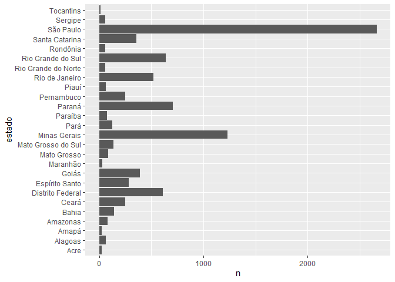
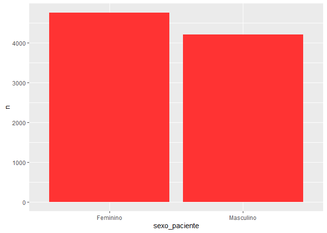
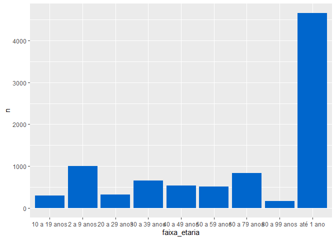
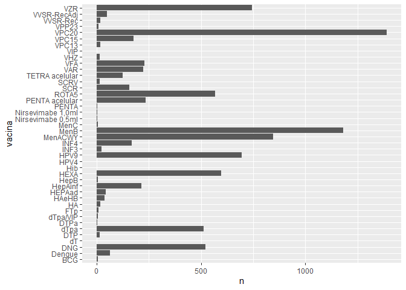

Vacinação
================

## Dados de janeiro de 2026 (dados incompletos)

### Contexto

O ano de 2026 começou e o Ministério da Saúde disponibilizou os dados de
vacinação até 05 de janeiro de 2026.  
O objetivo deste projeto é descrever o perfil dos dados de vacinas que
estão sendo aplicadas no serviço privado, portanto:  
- Qual a faixa etária dos vacinados até o dia 05/01/2025?  
- Quais as vacinas aplicadas nos primeiros 5 dias de 2026?  
- Quais estados estão aplicando mais vacina?  
- Qual sexo está vacinando mais?

### Tratamento dos dados - ETL

Importar pacotes

``` r
library(dplyr)
library(kableExtra)
library(ggplot2)
```

Importar dados

``` r
dados <- read.csv2("dados/vacinacao_jan_2026.csv")
```

Tratar tabela para:  
- Colunas importantes para análise  
- Filtrar somente serviços privados  
- Renomear colunas  
- Recodificar nome dos Estados

``` r
# filtrar por colunas
dados_filtrados <- dados %>% select(tp_sexo_paciente, nu_idade_paciente, 
sg_uf_estabelecimento, co_vacina, sg_vacina, co_estrategia_vacinacao)

#filtrar por serviços privados
dados_filtrados <- dados_filtrados %>% filter(co_estrategia_vacinacao == 8)

#renomear colunas
dados_filtrados <- dados_filtrados %>% rename(sexo_paciente = tp_sexo_paciente) %>% 
  rename(idade = nu_idade_paciente) %>% rename(estado = sg_uf_estabelecimento) %>% 
  rename(vacina = sg_vacina)

#vetor para nome dos estados
nomes_estados <- c("AC" = "Acre", "AP" = "Amapá", "AM" = "Amazonas", "PA" = "Pará",
             "RO" = "Rondônia", "RR" = "Roraima", "TO" = "Tocantins", 
             "AL" = "Alagoas", "CE" = "Ceará", "SE" = "Sergipe", "BA" = "Bahia",
             "PE" = "Pernambuco", "RN" = "Rio Grande do Norte", "PB" = "Paraíba",
             "MA" = "Maranhão", "PI" = "Piauí",
             "MT" = "Mato Grosso", "MS" = "Mato Grosso do Sul", "GO" = "Goiás",
             "DF" = "Distrito Federal",
             "SP" = "São Paulo", "RJ" = "Rio de Janeiro", "ES" = "Espírito Santo",
             "MG" = "Minas Gerais",
             "PR" = "Paraná", "SC" = "Santa Catarina", "RS" = "Rio Grande do Sul")

#alterar codigo dos estados
dados_filtrados$estado <- nomes_estados[dados_filtrados$estado]

#trocar siglas de masculino e feminino
sexo <- c("M" = "Masculino", "F" = "Feminino")
dados_filtrados$sexo_paciente <- sexo[dados_filtrados$sexo_paciente]

#criar coluna de faixa estária
dados_filtrados <- dados_filtrados %>%
  mutate(faixa_etaria = case_when(
    idade %in% 0:1   ~ "até 1 ano",
    idade %in% 2:9   ~ "2 a 9 anos",
    idade %in% 10:19 ~ "10 a 19 anos",
    idade %in% 20:29 ~ "20 a 29 anos",
    idade %in% 30:39 ~ "30 a 39 anos",
    idade %in% 40:49 ~ "40 a 49 anos",
    idade %in% 50:59 ~ "50 a 59 anos",
    idade %in% 60:79 ~ "60 a 79 anos",
    idade %in% 80:99 ~ "80 a 99 anos",
    TRUE ~ NA_character_
  ))

#os dados vieram sem o nome das vacinas 115 e 116
dados_filtrados <- dados_filtrados %>% 
  mutate(vacina = case_when(
    vacina == "" & co_vacina == 115 ~ "Nirsevimabe 0,5ml",
    vacina == "" & co_vacina == 116 ~ "Nirsevimabe 1,0ml",
    TRUE ~ vacina
  ))
```

### Estatistica Descritiva

``` r
#vacinas por estado
vac_estado <- dados_filtrados %>% group_by(estado) %>% count()
vac_estado <- vac_estado %>% mutate(porcentagem = (n / sum(vac_estado$n))*100)
vac_estado <- vac_estado %>% mutate(porcentagem = round(porcentagem, digits = 2)) %>% 
  arrange(desc(n))
vac_estado %>% kable() %>% kable_styling(
 bootstrap_options = "basic",
 position = "center",
 font_size = 14
)
```

<table class="table" style="font-size: 14px; margin-left: auto; margin-right: auto;">

<thead>

<tr>

<th style="text-align:left;">

estado
</th>

<th style="text-align:right;">

n
</th>

<th style="text-align:right;">

porcentagem
</th>

</tr>

</thead>

<tbody>

<tr>

<td style="text-align:left;">

São Paulo
</td>

<td style="text-align:right;">

2661
</td>

<td style="text-align:right;">

29.75
</td>

</tr>

<tr>

<td style="text-align:left;">

Minas Gerais
</td>

<td style="text-align:right;">

1234
</td>

<td style="text-align:right;">

13.79
</td>

</tr>

<tr>

<td style="text-align:left;">

Paraná
</td>

<td style="text-align:right;">

705
</td>

<td style="text-align:right;">

7.88
</td>

</tr>

<tr>

<td style="text-align:left;">

Rio Grande do Sul
</td>

<td style="text-align:right;">

639
</td>

<td style="text-align:right;">

7.14
</td>

</tr>

<tr>

<td style="text-align:left;">

Distrito Federal
</td>

<td style="text-align:right;">

611
</td>

<td style="text-align:right;">

6.83
</td>

</tr>

<tr>

<td style="text-align:left;">

Rio de Janeiro
</td>

<td style="text-align:right;">

520
</td>

<td style="text-align:right;">

5.81
</td>

</tr>

<tr>

<td style="text-align:left;">

Goiás
</td>

<td style="text-align:right;">

389
</td>

<td style="text-align:right;">

4.35
</td>

</tr>

<tr>

<td style="text-align:left;">

Santa Catarina
</td>

<td style="text-align:right;">

355
</td>

<td style="text-align:right;">

3.97
</td>

</tr>

<tr>

<td style="text-align:left;">

Espírito Santo
</td>

<td style="text-align:right;">

285
</td>

<td style="text-align:right;">

3.19
</td>

</tr>

<tr>

<td style="text-align:left;">

Ceará
</td>

<td style="text-align:right;">

248
</td>

<td style="text-align:right;">

2.77
</td>

</tr>

<tr>

<td style="text-align:left;">

Pernambuco
</td>

<td style="text-align:right;">

248
</td>

<td style="text-align:right;">

2.77
</td>

</tr>

<tr>

<td style="text-align:left;">

Bahia
</td>

<td style="text-align:right;">

142
</td>

<td style="text-align:right;">

1.59
</td>

</tr>

<tr>

<td style="text-align:left;">

Mato Grosso do Sul
</td>

<td style="text-align:right;">

139
</td>

<td style="text-align:right;">

1.55
</td>

</tr>

<tr>

<td style="text-align:left;">

Pará
</td>

<td style="text-align:right;">

125
</td>

<td style="text-align:right;">

1.40
</td>

</tr>

<tr>

<td style="text-align:left;">

Mato Grosso
</td>

<td style="text-align:right;">

89
</td>

<td style="text-align:right;">

0.99
</td>

</tr>

<tr>

<td style="text-align:left;">

Amazonas
</td>

<td style="text-align:right;">

81
</td>

<td style="text-align:right;">

0.91
</td>

</tr>

<tr>

<td style="text-align:left;">

Paraíba
</td>

<td style="text-align:right;">

77
</td>

<td style="text-align:right;">

0.86
</td>

</tr>

<tr>

<td style="text-align:left;">

Alagoas
</td>

<td style="text-align:right;">

66
</td>

<td style="text-align:right;">

0.74
</td>

</tr>

<tr>

<td style="text-align:left;">

Piauí
</td>

<td style="text-align:right;">

66
</td>

<td style="text-align:right;">

0.74
</td>

</tr>

<tr>

<td style="text-align:left;">

Rio Grande do Norte
</td>

<td style="text-align:right;">

58
</td>

<td style="text-align:right;">

0.65
</td>

</tr>

<tr>

<td style="text-align:left;">

Rondônia
</td>

<td style="text-align:right;">

57
</td>

<td style="text-align:right;">

0.64
</td>

</tr>

<tr>

<td style="text-align:left;">

Sergipe
</td>

<td style="text-align:right;">

56
</td>

<td style="text-align:right;">

0.63
</td>

</tr>

<tr>

<td style="text-align:left;">

Maranhão
</td>

<td style="text-align:right;">

33
</td>

<td style="text-align:right;">

0.37
</td>

</tr>

<tr>

<td style="text-align:left;">

Amapá
</td>

<td style="text-align:right;">

24
</td>

<td style="text-align:right;">

0.27
</td>

</tr>

<tr>

<td style="text-align:left;">

Acre
</td>

<td style="text-align:right;">

22
</td>

<td style="text-align:right;">

0.25
</td>

</tr>

<tr>

<td style="text-align:left;">

Tocantins
</td>

<td style="text-align:right;">

16
</td>

<td style="text-align:right;">

0.18
</td>

</tr>

</tbody>

</table>

``` r
# gráfico de vacinas por estado
ggplot(vac_estado, aes(n, estado)) + geom_col()
```

<!-- -->

``` r
#vacinas por sexo
vac_sexo <- dados_filtrados %>% group_by(sexo_paciente) %>% count()
vac_sexo <- vac_sexo %>% mutate(porcentagem = (n / sum(vac_sexo$n))*100)
vac_sexo <- vac_sexo %>% mutate(porcentagem = round(porcentagem, digits = 2))
vac_sexo %>% kable() %>% kable_styling(
  bootstrap_options = "basic",
  position = "center",
  font_size = 14
)
```

<table class="table" style="font-size: 14px; margin-left: auto; margin-right: auto;">

<thead>

<tr>

<th style="text-align:left;">

sexo_paciente
</th>

<th style="text-align:right;">

n
</th>

<th style="text-align:right;">

porcentagem
</th>

</tr>

</thead>

<tbody>

<tr>

<td style="text-align:left;">

Feminino
</td>

<td style="text-align:right;">

4747
</td>

<td style="text-align:right;">

53.06
</td>

</tr>

<tr>

<td style="text-align:left;">

Masculino
</td>

<td style="text-align:right;">

4199
</td>

<td style="text-align:right;">

46.94
</td>

</tr>

</tbody>

</table>

``` r
# gráfico de vacinas por sexo
ggplot(vac_sexo, aes(sexo_paciente, n)) + geom_col(fill = "#FF3333")
```

<!-- -->

``` r
#vacinas por faixa etária
vac_faixa <- dados_filtrados %>% group_by(faixa_etaria) %>% count()
vac_faixa <- vac_faixa %>% mutate(porcentagem = (n / sum(vac_faixa$n))*100)
vac_faixa <- vac_faixa %>% mutate(porcentagem = round(porcentagem, digits = 2))
vac_faixa %>% kable() %>% kable_styling(
  bootstrap_options = "basic",
  position = "center",
  font_size = 14
)
```

<table class="table" style="font-size: 14px; margin-left: auto; margin-right: auto;">

<thead>

<tr>

<th style="text-align:left;">

faixa_etaria
</th>

<th style="text-align:right;">

n
</th>

<th style="text-align:right;">

porcentagem
</th>

</tr>

</thead>

<tbody>

<tr>

<td style="text-align:left;">

10 a 19 anos
</td>

<td style="text-align:right;">

297
</td>

<td style="text-align:right;">

3.32
</td>

</tr>

<tr>

<td style="text-align:left;">

2 a 9 anos
</td>

<td style="text-align:right;">

995
</td>

<td style="text-align:right;">

11.12
</td>

</tr>

<tr>

<td style="text-align:left;">

20 a 29 anos
</td>

<td style="text-align:right;">

322
</td>

<td style="text-align:right;">

3.60
</td>

</tr>

<tr>

<td style="text-align:left;">

30 a 39 anos
</td>

<td style="text-align:right;">

647
</td>

<td style="text-align:right;">

7.23
</td>

</tr>

<tr>

<td style="text-align:left;">

40 a 49 anos
</td>

<td style="text-align:right;">

528
</td>

<td style="text-align:right;">

5.90
</td>

</tr>

<tr>

<td style="text-align:left;">

50 a 59 anos
</td>

<td style="text-align:right;">

503
</td>

<td style="text-align:right;">

5.62
</td>

</tr>

<tr>

<td style="text-align:left;">

60 a 79 anos
</td>

<td style="text-align:right;">

837
</td>

<td style="text-align:right;">

9.36
</td>

</tr>

<tr>

<td style="text-align:left;">

80 a 99 anos
</td>

<td style="text-align:right;">

161
</td>

<td style="text-align:right;">

1.80
</td>

</tr>

<tr>

<td style="text-align:left;">

até 1 ano
</td>

<td style="text-align:right;">

4656
</td>

<td style="text-align:right;">

52.05
</td>

</tr>

</tbody>

</table>

``` r
media <- round(mean(dados_filtrados$idade), digits = 2)
desvp <- round(sd(dados_filtrados$idade), digits = 2)
mediana <- median(dados_filtrados$idade)

print(paste("A média da idade é ", media, "com desvio padrão de ", desvp))
```

    ## [1] "A média da idade é  18.07 com desvio padrão de  25.3"

``` r
print(paste("A mediana da idade é", mediana))
```

    ## [1] "A mediana da idade é 1"

``` r
# gráfico de vacinas por faixa etária
ggplot(vac_faixa, aes(faixa_etaria, n)) + geom_col(fill = "#0066CC")
```

<!-- -->

``` r
#por tipo de vacina
vac_tipo <- dados_filtrados %>% group_by(vacina) %>% count()
vac_tipo <- vac_tipo %>% mutate(porcentagem = (n / sum(vac_tipo$n))*100) %>% 
  mutate(porcentagem = round(porcentagem, digits = 2)) %>% arrange(desc(n))
vac_tipo %>% kable() %>% kable_styling(
  bootstrap_options = "basic",
  position = "center",
  font_size = 14
)
```

<table class="table" style="font-size: 14px; margin-left: auto; margin-right: auto;">

<thead>

<tr>

<th style="text-align:left;">

vacina
</th>

<th style="text-align:right;">

n
</th>

<th style="text-align:right;">

porcentagem
</th>

</tr>

</thead>

<tbody>

<tr>

<td style="text-align:left;">

VPC20
</td>

<td style="text-align:right;">

1390
</td>

<td style="text-align:right;">

15.54
</td>

</tr>

<tr>

<td style="text-align:left;">

MenB
</td>

<td style="text-align:right;">

1180
</td>

<td style="text-align:right;">

13.19
</td>

</tr>

<tr>

<td style="text-align:left;">

MenACWY
</td>

<td style="text-align:right;">

845
</td>

<td style="text-align:right;">

9.45
</td>

</tr>

<tr>

<td style="text-align:left;">

VZR
</td>

<td style="text-align:right;">

744
</td>

<td style="text-align:right;">

8.32
</td>

</tr>

<tr>

<td style="text-align:left;">

HPV9
</td>

<td style="text-align:right;">

696
</td>

<td style="text-align:right;">

7.78
</td>

</tr>

<tr>

<td style="text-align:left;">

HEXA
</td>

<td style="text-align:right;">

595
</td>

<td style="text-align:right;">

6.65
</td>

</tr>

<tr>

<td style="text-align:left;">

ROTA5
</td>

<td style="text-align:right;">

566
</td>

<td style="text-align:right;">

6.33
</td>

</tr>

<tr>

<td style="text-align:left;">

DNG
</td>

<td style="text-align:right;">

522
</td>

<td style="text-align:right;">

5.84
</td>

</tr>

<tr>

<td style="text-align:left;">

dTpa
</td>

<td style="text-align:right;">

511
</td>

<td style="text-align:right;">

5.71
</td>

</tr>

<tr>

<td style="text-align:left;">

PENTA acelular
</td>

<td style="text-align:right;">

235
</td>

<td style="text-align:right;">

2.63
</td>

</tr>

<tr>

<td style="text-align:left;">

VFA
</td>

<td style="text-align:right;">

228
</td>

<td style="text-align:right;">

2.55
</td>

</tr>

<tr>

<td style="text-align:left;">

VAR
</td>

<td style="text-align:right;">

223
</td>

<td style="text-align:right;">

2.49
</td>

</tr>

<tr>

<td style="text-align:left;">

HepAinf
</td>

<td style="text-align:right;">

215
</td>

<td style="text-align:right;">

2.40
</td>

</tr>

<tr>

<td style="text-align:left;">

VPC15
</td>

<td style="text-align:right;">

176
</td>

<td style="text-align:right;">

1.97
</td>

</tr>

<tr>

<td style="text-align:left;">

INF4
</td>

<td style="text-align:right;">

167
</td>

<td style="text-align:right;">

1.87
</td>

</tr>

<tr>

<td style="text-align:left;">

SCR
</td>

<td style="text-align:right;">

156
</td>

<td style="text-align:right;">

1.74
</td>

</tr>

<tr>

<td style="text-align:left;">

TETRA acelular
</td>

<td style="text-align:right;">

124
</td>

<td style="text-align:right;">

1.39
</td>

</tr>

<tr>

<td style="text-align:left;">

Dengue
</td>

<td style="text-align:right;">

64
</td>

<td style="text-align:right;">

0.72
</td>

</tr>

<tr>

<td style="text-align:left;">

VVSR-RecAdj
</td>

<td style="text-align:right;">

49
</td>

<td style="text-align:right;">

0.55
</td>

</tr>

<tr>

<td style="text-align:left;">

HEPAad
</td>

<td style="text-align:right;">

44
</td>

<td style="text-align:right;">

0.49
</td>

</tr>

<tr>

<td style="text-align:left;">

HAeHB
</td>

<td style="text-align:right;">

37
</td>

<td style="text-align:right;">

0.41
</td>

</tr>

<tr>

<td style="text-align:left;">

INF3
</td>

<td style="text-align:right;">

24
</td>

<td style="text-align:right;">

0.27
</td>

</tr>

<tr>

<td style="text-align:left;">

VPC13
</td>

<td style="text-align:right;">

17
</td>

<td style="text-align:right;">

0.19
</td>

</tr>

<tr>

<td style="text-align:left;">

VVSR-Rec
</td>

<td style="text-align:right;">

17
</td>

<td style="text-align:right;">

0.19
</td>

</tr>

<tr>

<td style="text-align:left;">

HA
</td>

<td style="text-align:right;">

16
</td>

<td style="text-align:right;">

0.18
</td>

</tr>

<tr>

<td style="text-align:left;">

DTP
</td>

<td style="text-align:right;">

15
</td>

<td style="text-align:right;">

0.17
</td>

</tr>

<tr>

<td style="text-align:left;">

SCRV
</td>

<td style="text-align:right;">

15
</td>

<td style="text-align:right;">

0.17
</td>

</tr>

<tr>

<td style="text-align:left;">

VHZ
</td>

<td style="text-align:right;">

15
</td>

<td style="text-align:right;">

0.17
</td>

</tr>

<tr>

<td style="text-align:left;">

FTp
</td>

<td style="text-align:right;">

10
</td>

<td style="text-align:right;">

0.11
</td>

</tr>

<tr>

<td style="text-align:left;">

VPP23
</td>

<td style="text-align:right;">

8
</td>

<td style="text-align:right;">

0.09
</td>

</tr>

<tr>

<td style="text-align:left;">

BCG
</td>

<td style="text-align:right;">

7
</td>

<td style="text-align:right;">

0.08
</td>

</tr>

<tr>

<td style="text-align:left;">

HepB
</td>

<td style="text-align:right;">

7
</td>

<td style="text-align:right;">

0.08
</td>

</tr>

<tr>

<td style="text-align:left;">

dTpa/VIP
</td>

<td style="text-align:right;">

7
</td>

<td style="text-align:right;">

0.08
</td>

</tr>

<tr>

<td style="text-align:left;">

MenC
</td>

<td style="text-align:right;">

5
</td>

<td style="text-align:right;">

0.06
</td>

</tr>

<tr>

<td style="text-align:left;">

DTPa
</td>

<td style="text-align:right;">

4
</td>

<td style="text-align:right;">

0.04
</td>

</tr>

<tr>

<td style="text-align:left;">

Nirsevimabe 1,0ml
</td>

<td style="text-align:right;">

3
</td>

<td style="text-align:right;">

0.03
</td>

</tr>

<tr>

<td style="text-align:left;">

PENTA
</td>

<td style="text-align:right;">

3
</td>

<td style="text-align:right;">

0.03
</td>

</tr>

<tr>

<td style="text-align:left;">

Nirsevimabe 0,5ml
</td>

<td style="text-align:right;">

2
</td>

<td style="text-align:right;">

0.02
</td>

</tr>

<tr>

<td style="text-align:left;">

HPV4
</td>

<td style="text-align:right;">

1
</td>

<td style="text-align:right;">

0.01
</td>

</tr>

<tr>

<td style="text-align:left;">

Hib
</td>

<td style="text-align:right;">

1
</td>

<td style="text-align:right;">

0.01
</td>

</tr>

<tr>

<td style="text-align:left;">

VIP
</td>

<td style="text-align:right;">

1
</td>

<td style="text-align:right;">

0.01
</td>

</tr>

<tr>

<td style="text-align:left;">

dT
</td>

<td style="text-align:right;">

1
</td>

<td style="text-align:right;">

0.01
</td>

</tr>

</tbody>

</table>

``` r
# gráfico de vacinas por tipo
ggplot(vac_tipo, aes(n, vacina)) + geom_col()
```

<!-- -->

## Fonte dos dados

Ministério da Saúde. Dados Abertos. Acessado em 07 jan 2026. Disponível
em
[link](https://dadosabertos.saude.gov.br/dataset/doses-aplicadas-pelo-programa-de-nacional-de-imunizacoes-pni-2026)
